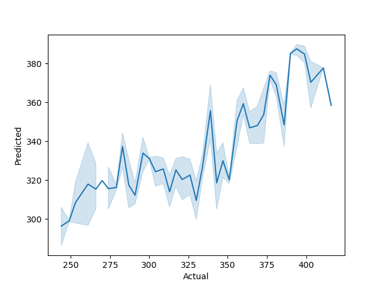
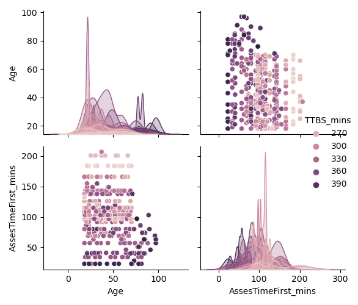
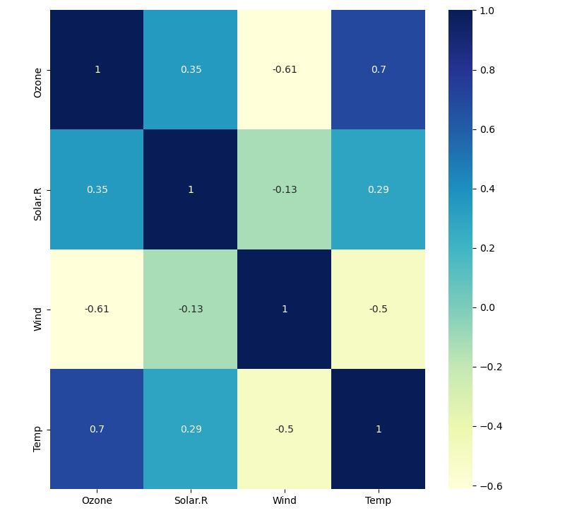

# NHS R Community Reticulate Webinar - a happy union 

## Overview of Scikit Learn - Andreas 

Andreas gives an overview of Scikit Learn ML library and its powerful uses.

## Setting up the reticulate environment and conversion between environments

The next tutorial focusses on how to use R's reticulate package to work with Python objects in R. The focus of the tutorial is to:

- Setup a miniconda environment and install packages to the environment
- Use the miniconda environment to bring in Python libraries to R
- Create R objects and pass these through to Python
- Creating functions in Python and passing through reticulate style

## Modelling with Python and R

This section looks at cleaning data in R and passing it through to Scikit learn:

- Data setup in R
- Splitting data and using Python's train_test_split function
- Fitting a multiple linear regression model with Scikit learn
- Making predictions with the model in Python and passing back to an R data frame

## Visualising R data with Python's Matplotlib and Seaborn packages

This section looks at visualising:

- The model fit from the regression in Python and R Plotly
- Running an external Python script in R to create a Seaborn pairplot
- Creating a correlation matrix with Python's heatmap

The visual outputs are included hereunder:

Seaborn Plot

Seaborn Pairplot

