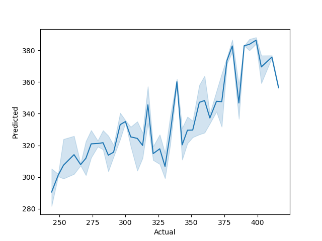
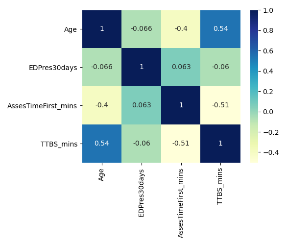

# NHS R Community Reticulate Webinar - a happy union 

## Overview of Scikit Learn - Andreas 

Package `reticulate` [@R-reticulate] makes the integration between `R` and `Python` so easy that the first time I tried it I really could not believe my eyes. Here is an example where `Python` runs a text mining process in the background with `Scikit-learn` [@scikit-learn] and plots some results with `ggplot2` [@Wickham2016], in just a few lines of `R` code:

It is really _that_ simple!

Package `reticulate` is a game-changer, because the `R` user like myself gains access to the suite of `Python`'s powerful Machine Learning tools, without necessarily being a `Python` expert.

The idea is to use the `Python` elements that are clearly superior to the `R` counterparts, without necessarily having to master `Python`. Personally, I needed access to a much more advanced Machine Learning interface than the ones that are available in `R`, and so I spent a few weeks building a pipeline with `Python`'s `Scikit-learn`. I still do not know `Python` very well. But I do know `Scikit-learn` now. The result? Immensely faster processing times, with results readily available for reporting and visualization with `R`'s `shiny` [@R-shiny]  and `golem` [@R-golem].

In my slide pack I give an overview of `Scikit-learn`. I then compare it with `R`'s well-known Machine Learning libraries `tidymodels` [@R-tidymodels]  and `mlr3` [@R-mlr3]. Finally, I provide a few practical tips for attacking Machine Learning problems with these three libraries.

## Reticulate with R examples - Gary Hutson

Next, the following sections take you through the content of the webinar:

## Setting up the reticulate environment and conversion between environments

The next tutorial focusses on how to use R's reticulate package to work with Python objects in R. The focus of the tutorial is to:

- Setup a miniconda environment and install packages to the environment
- Use the miniconda environment to bring in Python libraries to R
- Create R objects and pass these through to Python
- Creating functions in Python and passing through reticulate style

## Modelling with Python and R

This section looks at cleaning data in R and passing it through to Scikit learn:

- Data setup in R
- Splitting data and using Python's train_test_split function
- Fitting a multiple linear regression model with Scikit learn
- Making predictions with the model in Python and passing back to an R data frame

## Visualising R data with Python's Matplotlib and Seaborn packages

This section looks at visualising:

- The model fit from the regression in Python and R Plotly
- Running an external Python script in R to create a Seaborn pairplot
- Creating a correlation matrix with Python's heatmap

The visual outputs are included hereunder:

# Conclusion

There is much more that can be done with reticulate, such as building Tensorflow and Keras interfaces, if you are inclined, but it really opens up the tools that you can use for analytical tasks.

# References

